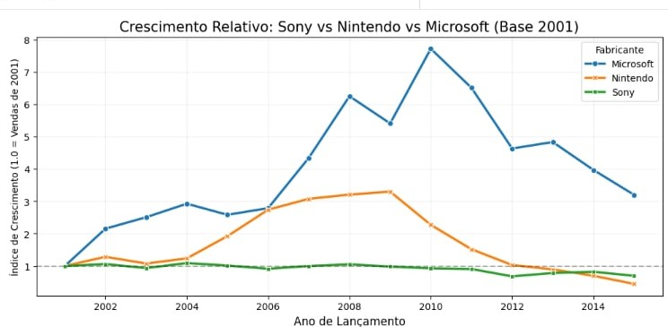
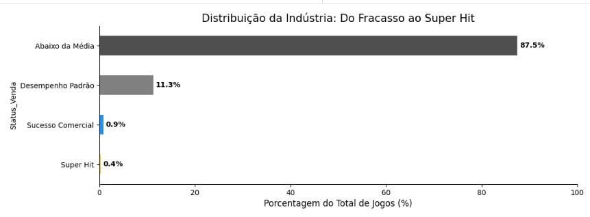

# 🎮 Análise de Performance: A Guerra dos Consoles (2001-2015)

Este projeto apresenta um estudo aprofundado sobre a dinâmica competitiva entre **Sony, Nintendo e Microsoft**. Através de uma abordagem híbrida entre **Python** e **SQL**, a análise explora o volume de vendas globais, taxas de crescimento relativo e a distribuição de sucesso comercial na indústria de jogos.

## 📌 Destaques do Projeto

* **Ambiente Relacional:** Migração de dados de arquivos flat (`.csv`) para um banco de dados relacional `SQLite`.
* **Tratamento de Dados:** Implementação de técnicas de *Forward Fill* e *Backward Fill* para correção de séries temporais.
* **Normalização Estatística:** Uso de **Base Indexada (1.0)** para comparar a real velocidade de expansão.
* **Vetorização NumPy:** Categorização de performance (*Super Hits*) via `np.where` para alta performance.

## 📊 Estrutura da Análise

### 1. Evolução Macroeconômica
Contextualização do volume total de software vendido globalmente para estabelecer a linha de base do mercado.

### 2. Guerra dos Consoles (Maturidade vs. Expansão)
Uma comparação entre o **Volume Bruto** e a **Velocidade de Crescimento**:
* **Sony & Nintendo:** Líderes em faturamento absoluto, enfrentando barreiras de crescimento devido à maturidade de suas bases.
* **Microsoft:** Demonstrando a maior aceleração proporcional do período, atuando como o elemento de "quebra de monopólio".

### 3. Distribuição "Do Fracasso ao Super Hit"
Segmentação científica da indústria para provar a tese da **Cauda Longa**:
* **Super Hits (Top 1%):** Títulos com vendas $\ge 10M$ que sustentam o faturamento da indústria.
* **Cauda Longa:** A vasta maioria dos lançamentos que possuem menor escala comercial individual.

## 🛠️ Tecnologias Utilizadas
* **Linguagem:** Python 3.x
* **Manipulação de Dados:** `Pandas`, `NumPy`
* **Banco de Dados:** `SQLite3`
* **Visualização:** `Seaborn`, `Matplotlib`

---

## 👨‍💻 Autor

**Igor Vinicius**

